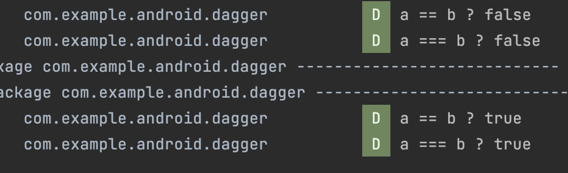
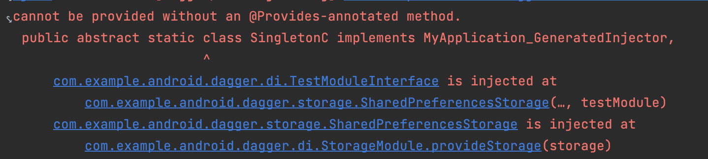
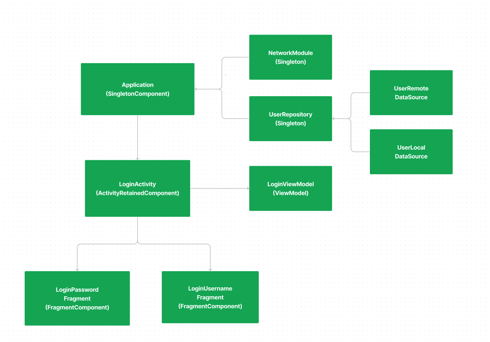

DI를 활용하여 Android 생명 주기에 따른 적절한 객체 참조를 위한. 객체 의존성 분리 / 주기 클래스별 그래프를 그려낼 수 있다<!--more-->
<br/><br/><br/>

# 작성 목표

1. 위 가이드를 읽는 과정에서 용어 위주로 정리 해보기 
    * 최대한 영어로 기억해보자
    <p/>
2. 퀴즈 만들기
    <p/>
3. 위 가이드를 읽고 난 후 해볼 수 있는 실습 생각해보기 
    * 그래프 피그마를 활용하여 만들기 

<br/>

# 학습 추천 가이드
Android 전용 DI인 Hilt를 이해하는데 수동 종속삽입, Dagger 적용, Hilt 적용 순으로 읽어보시면 이해가 잘 되었습니다.

### 참조 사이트
- [Android Develop Training - 수동 종속 삽입](https://developer.android.com/training/dependency-injection/manual?hl=ko) 
- [Android Develop Training - Dagger 적용](https://developer.android.com/training/dependency-injection/dagger-android?hl=ko)
- [Android Develop Training - Hilt 적용](https://developer.android.com/training/dependency-injection/hilt-android?hl=ko)

### 정리노트
- [주석 요약본](https://developer.android.com/training/dependency-injection/hilt-cheatsheet?hl=ko)

<br/>

# DI (dependency injection)

|용어            |설명|
|:--------------|:----------|
|종속항목 수동삽입&nbsp;&nbsp;|생성자 매개변수, Setter 를 활용하여 주입|
|종속항목 자동삽입&nbsp;&nbsp;|컴파일 타임에 수행하는 Dagger, Hilt(Android)|

<br/>

# **Dagger** 

## 용어 정리

### Android framework classes 에 종속항목 추가하기

|Classes|적용|
|:---|:----------|
|Application|appComponent lives to share its lifecycle|
|Activity, Fragment|Field injection should only be used in Android framework classes where constructor injection cannot be used.|

<br/>

### Injecting Activities

|절차|설명|
|:---|:----------|
|Expose a Inject Function&nbsp;&nbsp;|Function that takes as a _parameter_ in __@Component__ Interface|
|Dagger Graph 연결|Use the appComponent defined in your Application and call the Inject|
||Activity before calling **super.onCreate**|
||Fragment before calling **super.onAttach**|
|종속항목|필드 삽입|

<br/>

### Dagger Module

:  Modules are a way to semantically encapsulate information on how to provide objects 

> Note: You can use the @Provides annotation in Dagger modules to tell Dagger how to provide classes that your project doesn't own (e.g. an instance of Retrofit).

|모듈절차|설명|
|:--|:--|
|클래스 인스턴스 제공방법&nbsp;&nbsp;|expose @Provides function, return Class Instance|
|클래스 종속 항목|@Provides function Parameters|
|Dagger Graph 연결방법|Add Module to the @Component interface|

<br/>

### Dagger Scopes (범위지정)
 
: Scoping a type to the component’s lifecycle

|주의사항|
|:--|
| - Memory leaks|
| - Modules that use a scope annotation can only by used in components that are annotated with the same scope.|

<br/>

### 하위 구성요소

|절차|설명|
|:--|:--|
|구성요소 생성|@Subcomponent 주석 지정|
||@Subcomponent.Factory Interface 구현 (인스턴스 생성 방법)|
|Dagger Graph 연결(알리기)&nbsp;&nbsp;|@Module Class 생성|
||상위 구성요소에 Module 추가|
||상위 구성요소에서 하위 구성요소 인스턴스 생성하는 팩토리 함수 추가|
|종속삽입|Application Framework Classes 에 특수 삽입|

<br/>

### 하위 구성요소 범위 할당

: 하위요소는 구성요소 요청될 때마다 항상 동일한 인스턴스를 제공하기 위해 하위요소, 구성요소 모두 주석을 지정해야함 

|범위 할당 규칙|
|:--|
|- 유형이 범위 주석으로 표시되면 동일한 범위로 주석이 지정된 구성요소에서만 이 유형을 사용할 수 있습니다.|
|- 구성요소가 범위 주석으로 표시되면 구성요소는 이 주석이 있는 유형 또는 주석이 없는 유형만 제공할 수 있습니다.|
|- 하위 구성요소는 상위 구성요소 중 하나에서 사용하는 범위 주석을 사용할 수 없습니다.| 

## 퀴즈

```
Q. 다음 Dagger 관련된 설명 중 틀린 설명을 고르시오.

1. Dagger 리플렉션 기반의 솔루션이다
2. Component 는 필요한 종속 항목들의 목록과 제공 방법을 포함한 그래프이다
3. Dagger 구성핵심 - @Inject 주석은 Factory (Method Pattern) 생성을 대신 가능하게 해준다 
4. Dagger 구성핵심 - 종속 항목 범위 지정을 위해 @Scope 주석을 활용한다 
5. Dagger 구성핵심 - Components 구성을 위해 @Component 주석을 활용한다
```

<br/>

**Android 앱에서 Dagger 사용**

```
Q. 권장사항 으로 올바른 것은 ? 

1. @Inject 와 Setter Method 를 사용하여 Dagger 그래프에 유형을 추가합니다
2. @Provides 인터페이스에 어떤 구현이 있어야 하는지 Dagger 에 알립니다
3. @Binds 프로젝트가 소유하지 않은 클래스 제공 방법을 Dagger 에 알립니다
4. @ApplicationScope, @LoggedUserScope, @ActivityScope는 범위 주석으로 사용되는 기간을 제어할 수 있습니다
```

<br/>

**Dagger Module**

```
Q. 각 클래스의 인스턴스를 제공하는 방법(Dagger 모듈 내부의 정보)을 Dagger에 알리는 방법을 설명하세요.

- 일반 Class                             : 생성자 삽입, 
- Android Framework Classes             : 필드 삽입(종속항목) & Expose Inject Function, 
- Classes that your project doesn’t own : @Provides, 
- Interface                             : @Binds
```

<br/>

# Hilt 종속삽입

가이드는 Hilt 사용법에 대한 소개를 하고 있습니다.

그러므로 Dgger와 비교하며 바꾸는 과정을 실습해보는 것이 도움이 됩니다.

<br/>

## Android Framework Classes 종속 항목 추가, Injecting Activies

|1. Injecting Android Classes&nbsp;&nbsp;&nbsp;&nbsp;&nbsp;&nbsp;&nbsp;&nbsp;| annotation |
|:--|:--|
|- Application | @HiltAndroidApp |
|- Activity, Fragment ..| @AndroidEntryPoint |
|- ViewModel | @HiltViewModel | 

|2. Android Classes 종속항목 추가&nbsp;&nbsp;| Annotation |
|:--|:--|
|필드삽입|@Inject|

<br/>

## Module

|절차|설명|
|:--|:--|
|인스턴스 제공 방법 진입점|@Module, @InstallIn(사용될 Android Class)|
|인스턴스 추상 함수 구현| 인터페이스는 @Binds, 외부라이브러리 또는 빌더패턴은 @Provides |
|한정자를 사용한 동일 유형 여러 추상 함수 제공 &nbsp;&nbsp;| @Qualifier, @Retention(AnnorationRetention.BINARY) |

<br/>

## Android 클래스용으로 생성된 구성요소

: @InstallIn 주석에 참조할 수 있는 관련 Hilt 구성요소가 있다.

> Q Hilt 구성요소 ??  android 클래스에 결합을 삽입해야 하는 요소

<br/>


|설명||
|:---|---|
|**Hilt 구성요소**&nbsp;&nbsp;|SingletonComponent, ActivityRetainedComponent,<br/> ViewModelComponent, FragmentComponent etc..|
|**구성요소 전체기간**&nbsp;&nbsp;|해당 Android 클래스의 수명 주기|
|**구성요소 범위**|기본 결합은 범위가 지정되지 않는다. 결합 요청할 때마다 새 인스턴스 생성 |
||Q. SingletonComponent 로 지정되어도 Activity가 다르면<br/> 새 인스턴스가 생성되는가 ? Yes|
|||
|**구성요소 계층구조**|구성요소의 다른 결합 또는 하위 구성요소의 다른 결합의 종속항목으로<br/> 설치된 모듈의 결합에 액세스 할 수 있다.|
||Q. @ Singleton 모듈 클래스에서 @ActivityScope 모듈의 클래스 인스턴스를<br/> 가져올 수 있다?? NO|
|||
|**구성요소 기본결합**|각 Hilt 구성요소는 Hilt가 고유한 맞춤 결합에 <br/> 종속 항목으로 삽입할 수 있는 기본 결합 세트와 함께 제공됩니다.|
||Q. @SingletonComponent 구성요소는 기본결합으로 application 으로 <br/>제공한다 ?? Yes|
|| application 객체 대신 @ApplicationContext context: Context <br/>으로 사용할 수도 있다 |

<br/>

## Hilt가 지원하지 않는 Android 클래스에 종속 항목 삽입

|절차|
|:--|
|interface 정의 - @EntryPoint, @InstallIn(구성요소)|
|EntryPointAccessors 진입점 연결 - 매개변수가 @InstallIn에 정의된 구성요소와 일치해야함|


<br/>

## Hilt 적용 실습해보기

: **실습을 통해 사용 방법에 대해 쉽게 이해 할 수 있었습니다.**
- [Dagger-to-hilt 실습하기](https://developer.android.com/codelabs/android-dagger-to-hilt?hl=ko#0)

<br/>

# 추가 고민

> 프로젝트에서 DI 구조를 다른 사람들이 쉽게 파악할 수 있도록 하려면 어떻게 해야 할가 ? 

## 그래프 그리기 (피그마)



### 특징
- 한눈에 파악하기 쉽다
- 그래프 구조 변경에 따라 수정이 불가피 하다 (번거로울 수 있을 것 같다)

## 프로젝트 Directroy 활용하기

~~~
- APP
    - etc (Retrofit, Okhttp .. )
    - Application.class
    - Ui
        - Activity
        - ViewModel 
        - Feature
            - Fragment
            - ViewModel 
    - Data
        - Source
            - DataSource
        - Repository
        - model
    - Di
~~~

### 특징
- 별도 문서 참조 없이 파악이 가능
- 단일(작은) 프로젝트일 경우에만 적용 가능하다,여러 모듈 참조로 발전한 경우에 대한 고려 필요
- DI 모듈 참조에 대해 Android Framework Classes 폴더 단위로 구분할 경우 변경에 대한 자유성이 떨어지므로 Annotation, Naming 등 다른 노력이 필요

<br/>

### 주관적인 생각
> 프로젝트 구조를 통해 파악하는 습관을 들이는게 최소한의 수정으로 이해할 수 있을 것 같다.